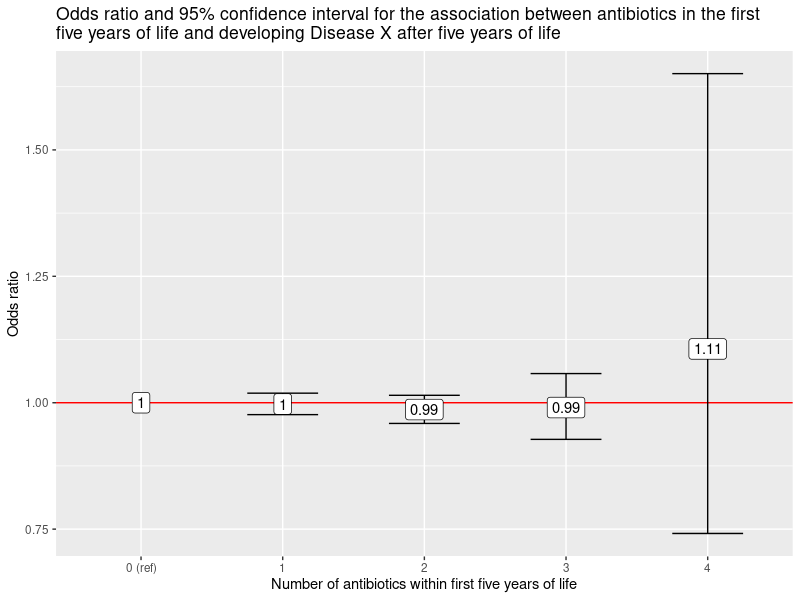

# Test: Register Based Study

This is a test of the programming skills required to undertake a register based study.

## Scenario

You are investigating the hypothesis "Are antibiotics in the first five years of life associated with developing Disease X after five years of life?"

## Data

To investigate this, you have access to three (fake) registries, each corresponding to a file inside the folder "data_raw":

1.  birth_registry.xlsx (contains 10 000 people).
    -   id: ID number.
    -   date_of_birth: Date of birth.
2.  diagnosis_registry.xlsx (contains only the people who have received an ICD-10 diagnosis of "Disease X").
    -   id: ID number.
    -   date_of_icd10_diagnosis: The date at which the person received an ICD-10 diagnosis of "Disease X".
3.  prescription_registry.xlsx (contains only the people who have received an antibiotic prescription).
    -   id: ID number.
    -   date_of_receiving_antibiotics: The date at which the person was prescribed an antibiotic.

## Definitions

For the purposes of this study, we define a person as having "Disease X" on the date of their third ICD-10 diagnosis.

We also define a year to contain 365.25 days.

## Instructions

Create an R script that does the following:

1.  Creates a single data set that:

    -   Is 10 000 rows long (i.e. One row per person).
    -   Has six columns:
        -   ID number (NUMERIC INTEGER).
        -   Date of birth (DATE).
        -   Exposure: Number of antibiotics prescribed in the first five years of life (NUMERIC INTEGER).
        -   Date of third ICD-10 diagnosis (NA if not applicable, otherwise DATE).
        -   Outcome: Does this person have three ICD-10 diagnoses? (TRUE/FALSE).
        -   Included in study: FALSE if this person has three ICD-10 diagnoses within the first five years of life, otherwise TRUE.

2.  Saves the data set to an Excel file.

3.  Runs a logistic regression, testing the hypothesis "Are antibiotics in the first five years of life associated with developing Disease X after five years of life?" (Note that you are being tested on technical programming skills, do not consider exposure-time or any other kind of epidemiological issues).

4.  Create a plot similar to this:

Run the R script, copy the logistic regression output and the plot to a word/docx/text file and write a short paragraph describing the results.

## Deliverables

Send the:

-   R script.
-   Excel file data set.
-   Word/docx/text file.

To the requested email address.
